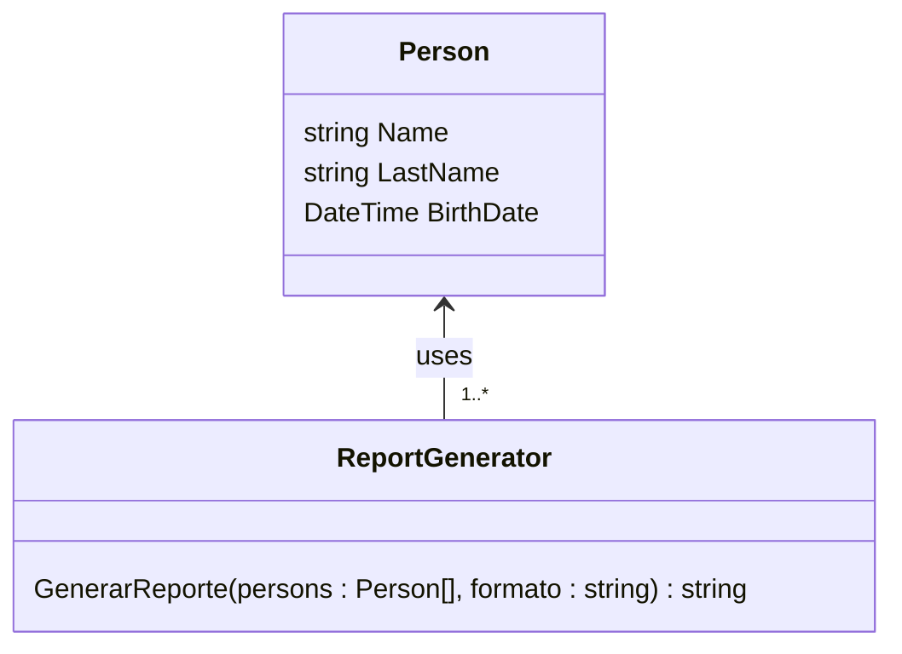

<!-- markdownlint-disable-next-line MD033 MD041 -->


# Universidad Católica del Uruguay

## Programación II

# Ejercicio de aplicación del Open/Closed Principle

## Objetivo

El objetivo de este ejercicio es aplicar el [Open/Closed
Principle](https://github.com/ucudal/PII_Guias/blob/main/OCP.md). El principio
dice:

> Las clases deben ser abiertas a la extensión, pero cerradas a la modificación.
>
> Que una clase sea “abierta a la extensión” quiere decir que las
> responsabilidades de la clase pueden ser extendidas se puede agregar nuevas
> responsabilidades mediante herencia o mediante una combinación de herencia y
> composición o agregación.
>
> Que una clase es “cerrada a la modificación” quiere decir que no es posible y
> no es necesario si se cumple el principio realizar cambios en el código de esa
> clase.

## Contexto

En este ejercicio vamos a generar listas de personas en archivos PDF, CSV, TXT y
MD. La clase `Person` es la misma que hemos utilizado en ejercicios anteriores.



Te damos el código de las clases [`Person`](./src/Library/Person.cs) y
[`ReportGenerator`](./src/Library/ReportGenerator.cs) funcionando, así como un
ejemplo de uso en la clase [`Program`](./src/Program/Program.cs).

### Parte 1. Agregar un nuevo formato

Agrega la posibilidad de generar reportes en formato Markdown. Te damos el
código para hacerlo a continuación:

```csharp
StringBuilder sb = new StringBuilder();
sb.AppendLine("# Person Report");
sb.AppendLine();
sb.AppendLine("| First Name | Last Name | Age |");
sb.AppendLine("|-----------|-----------|-----|");

foreach (Person person in people)
{
      sb.AppendLine($"| {EscapeMarkdown(person.FirstName)} | {EscapeMarkdown(person.LastName)} | {person.Age} |");
}

string markdown = sb.ToString();
File.WriteAllText(outputPath, markdown, Encoding.UTF8);
```

> [!NOTE]
>
> ¿En cuántos lugares tuviste que hacer cambios?


### Parte 2. Aplicar el principio abierto/cerrado

Como te habrás dado cuenta, la clase
[`ReportGenerator`](./src/Library/ReportGenerator.cs) no es abierta la extensión
ni cerrada a la modificación: agregar un nuevo formato implicó modificar el
método `GenerateReport`  y agregar un nuevo método para generar el archivo en
formato Markdown.

Agrega nuevas clases y modifica
[`ReportGenerator`](./src/Library/ReportGenerator.cs) para que agregar un nuevo
formato no implique agregar un nuevo método, sino agregar una nueva clase.

### Parte 3. Agrega otro nuevo formato

Agrega la posibilidad de generar el reporte en formato CSV, o *comma separated
values*. Te damos el código a continuación:

```csharp
using CsvHelper;
using CsvHelper.Configuration;

…

CsvConfiguration config = new CsvConfiguration(CultureInfo.InvariantCulture)
{
      HasHeaderRecord = true,
};

using (StreamWriter writer = new StreamWriter(outputPath, false, Encoding.UTF8))
{
      using (CsvWriter csv = new CsvWriter(writer, config))
      {
         csv.WriteHeader<Person>();
         csv.NextRecord();
         csv.WriteRecords(people);
      }
}
```

> [!NOTE]
>
> ¿En cuántos lugares tuviste que hacer cambios? Deberían haber sido muchos
> menos que en la parte anterior.

## Uso de 

Es posible usar GitHub Copilot en este repositorio. Consulta [cómo usar Copilot
para aprender](./COPILOT.md).
